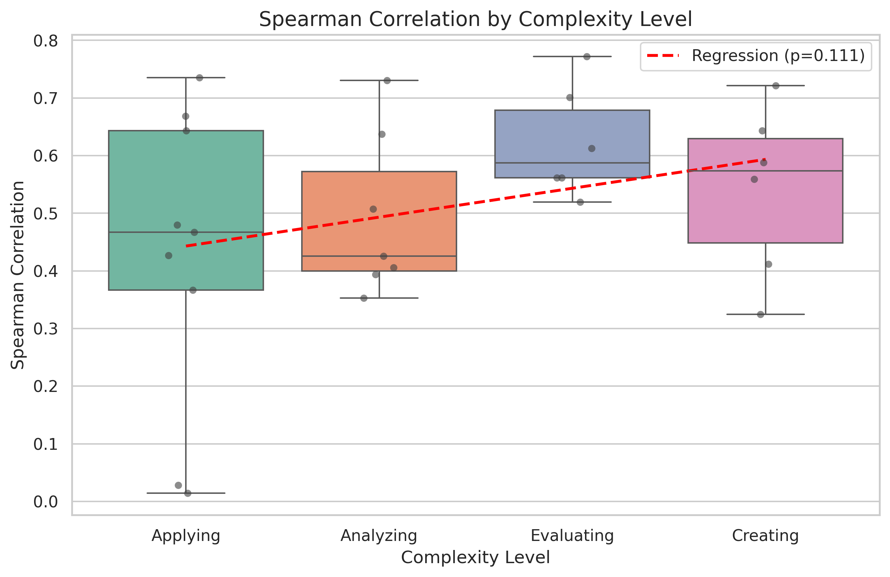
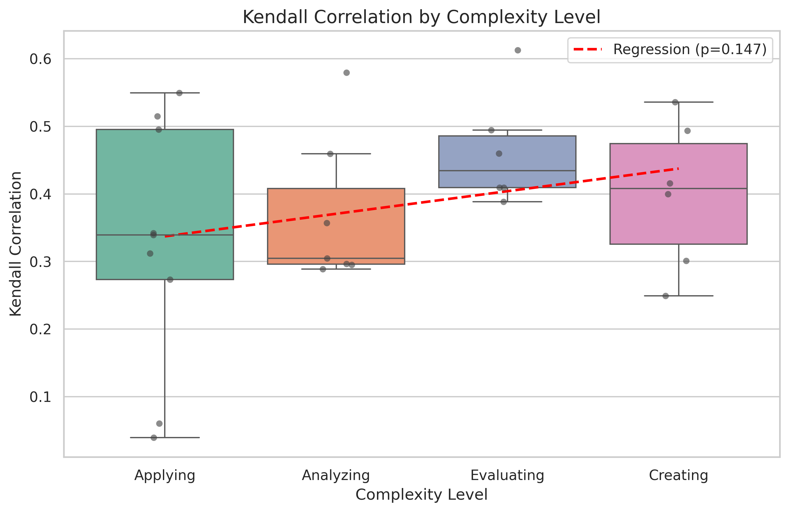
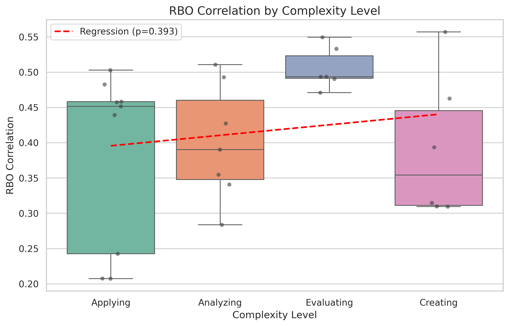

# Prompt Complexity Analysis Report

## 1. 实验方法 (Methodology)

我们将所有Benchmark按照认知复杂度（Cognitive Complexity）分为四个等级：
1. **Applying (应用)**: 执行已知规则或算法。
2. **Analyzing (分析)**: 分解信息，寻找逻辑联系。
3. **Evaluating (评价)**: 基于标准进行批判性判断。
4. **Creating (创造)**: 整合信息生成新作品或架构。

为了检验复杂度与Benchmark有效性（与LMArena的一致性）之间的关系，我们进行了以下两项统计检验：
- **Kruskal-Wallis H Test**: 检验不同复杂度组别的相关系数分布是否存在显著差异（非参数检验）。
- **Ordinal Linear Regression**: 将复杂度作为有序变量 (1-4) 进行线性回归，检验是否存在显著的线性趋势。

## 2. 实验结果 (Results)

### 显著性检验结果汇总 (Significance Test Summary)

| Metric | Kruskal-Wallis p-value | Regression p-value |
| :--- | :--- | :--- |
| Spearman | 0.3250 | 0.1113 |
| Kendall | 0.3547 | 0.1472 |
| RBO | 0.0558 | 0.3930 |

### 详细统计结果 (Detailed Statistical Results)

| Metric | Kruskal-Wallis H | KW p-value | Regression Slope | $R^2$ | Regression p-value |
| :--- | :--- | :--- | :--- | :--- | :--- |
| Spearman | 3.4678 | 0.3250 | 0.0501 | 0.0946 | 0.1113 |
| Kendall | 3.2499 | 0.3547 | 0.0334 | 0.0791 | 0.1472 |
| RBO | 7.5688 | 0.0558 | 0.0149 | 0.0282 | 0.3930 |

## 3. 图表解释与样本量 (Boxplot Interpretation & Sample Size)

下表列出了各个复杂度分类下的 Benchmark 数量，以及箱线图（Boxplot）中各元素的统计学含义。

| 元素 (Element) | 含义 (Meaning) |
| :--- | :--- |
| **有色方块 (Colored Box)** | **四分位距 (IQR)**: 覆盖数据的中间50%范围，从第25百分位数 (Q1) 到第75百分位数 (Q3)。方块的高度反映了该组数据的离散程度（方差）。 |
| **方块内的横线 (Line inside box)** | **中位数 (Median)**: 数据的中间值，将数据分为上下两部分。 |
| **上下须 (Whiskers)** | **数据范围 (Range)**: 延伸至1.5倍IQR范围内的最大值和最小值（不包括离群点）。超出此范围的点通常被视为离群点（Outliers）。 |
| **黑点 (Black Dots)** | **原始数据点 (Raw Data)**: 每个点代表一个具体的 Benchmark。 |

### 各分类 Benchmark 数量统计

| Complexity Category | Benchmark Count |
| :--- | :--- |
| Applying | 9 |
| Analyzing | 7 |
| Evaluating | 6 |
| Creating | 6 |
| **Total** | **28** |

### 各分类箱线图数值统计 (Descriptive Statistics)

下表列出了每个Metric在不同复杂度分类下的具体统计数值（对应箱线图中的各个元素）。

| Metric | Complexity | Count | Min | Q1 | Median | Q3 | Max | Mean | Std |
| :--- | :--- | :--- | :--- | :--- | :--- | :--- | :--- | :--- | :--- |
| Spearman | Applying | 9 | 0.0145 | 0.3665 | 0.4674 | 0.6434 | 0.7356 | 0.4257 | 0.2593 |
| Spearman | Analyzing | 7 | 0.3528 | 0.3998 | 0.4257 | 0.5723 | 0.7305 | 0.4933 | 0.1408 |
| Spearman | Evaluating | 6 | 0.5197 | 0.5617 | 0.5872 | 0.6790 | 0.7722 | 0.6215 | 0.0966 |
| Spearman | Creating | 6 | 0.3244 | 0.4488 | 0.5736 | 0.6294 | 0.7213 | 0.5414 | 0.1477 |
| Kendall | Applying | 9 | 0.0396 | 0.2733 | 0.3393 | 0.4954 | 0.5495 | 0.3252 | 0.1838 |
| Kendall | Analyzing | 7 | 0.2889 | 0.2959 | 0.3047 | 0.4081 | 0.5798 | 0.3688 | 0.1110 |
| Kendall | Evaluating | 6 | 0.3885 | 0.4093 | 0.4346 | 0.4858 | 0.6129 | 0.4624 | 0.0834 |
| Kendall | Creating | 6 | 0.2492 | 0.3259 | 0.4079 | 0.4743 | 0.5358 | 0.3993 | 0.1095 |
| RBO | Applying | 9 | 0.2075 | 0.2427 | 0.4517 | 0.4581 | 0.5030 | 0.3834 | 0.1248 |
| RBO | Analyzing | 7 | 0.2838 | 0.3478 | 0.3904 | 0.4601 | 0.5107 | 0.4001 | 0.0824 |
| RBO | Evaluating | 6 | 0.4710 | 0.4912 | 0.4934 | 0.5232 | 0.5494 | 0.5051 | 0.0297 |
| RBO | Creating | 6 | 0.3096 | 0.3111 | 0.3543 | 0.4454 | 0.5571 | 0.3913 | 0.1017 |

## 4. 结果分析 (Analysis)

### Spearman Analysis
- **趋势**: 未发现显著的线性趋势 (p=0.1113)。
- **解释**: 任务认知复杂度的提升并没有显著改变Benchmark与LMArena的一致性。
- **分布差异**: 不同复杂度组别之间的分布没有显著差异 (KW p=0.3250)。

### Kendall Analysis
- **趋势**: 未发现显著的线性趋势 (p=0.1472)。
- **解释**: 任务认知复杂度的提升并没有显著改变Benchmark与LMArena的一致性。
- **分布差异**: 不同复杂度组别之间的分布没有显著差异 (KW p=0.3547)。

### RBO Analysis
- **趋势**: 未发现显著的线性趋势 (p=0.3930)。
- **解释**: 任务认知复杂度的提升并没有显著改变Benchmark与LMArena的一致性。
- **分布差异**: 不同复杂度组别之间的分布没有显著差异 (KW p=0.0558)。

## 5. 图表 (Figures)

以下图表展示了不同复杂度等级下的相关系数分布及回归趋势线：

*Figure 1: Spearman Correlation Distribution across Complexity Levels*

*Figure 2: Kendall Correlation Distribution across Complexity Levels*

*Figure 3: RBO Correlation Distribution across Complexity Levels*
